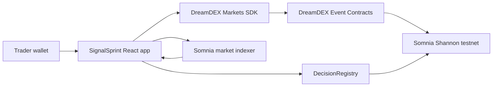

# SignalSprint

SignalSprint turns short-duration DreamDEX Event Contracts into a complete decision-learning loop: discover a live market, record a reason and confidence level, execute a bounded IOC trade, follow settlement, and review the result through an on-chain decision receipt.

Built for the **Somnia x DreamDEX Event Contracts Hackathon**.

## Why SignalSprint

Prediction markets record what traders bought, but not why they bought it. SignalSprint connects each trade to its thesis and confidence, then scores the decision after settlement. This creates a portable history of reasoning—not merely a list of fills.

The app also supports **Reason Duels**: two wallets commit independent calls on the same market without creating a separate prize pool. The market itself determines the outcome.

## Features

- Discovers live BTC and ETH Event Contracts through the DreamDEX SDK
- Shows expiry, market probability, order-book liquidity, and maximum loss before signing
- Executes tick-aligned, bounded Immediate-or-Cancel orders
- Revalidates market state and pool binding immediately before execution
- Avoids unnecessary token approvals and falls back to reset-first approval only when required
- Records confidence and thesis as wallet-authored receipts on Somnia
- Rebuilds history by merging indexed fills with on-chain decision metadata
- Tracks market settlement and supports redemption
- Calculates calibration and market-relative decision scores
- Creates shareable, fully on-chain Reason Duels

## Architecture



SignalSprint is a Vite/React client application. Trading and settlement use `@somnia-chain/markets-sdk`; contract reads and writes use `viem`. Browser storage is only a cache—the blockchain and market indexer are the authoritative sources.

## On-chain contract

| Item | Value |
| --- | --- |
| Network | Somnia Shannon testnet |
| Contract | `DecisionRegistry` |
| Address | `0x4ac0e9353432fdce17948e0b2a2162de1a4d3593` |
| Source | [`contracts/DecisionRegistry.sol`](contracts/DecisionRegistry.sol) |

`DecisionRegistry` stores wallet-authored decision receipts and no-pot Reason Duels. Authentication is native: contract writes are attributed through `msg.sender`, so no separate account system or backend is required.

## Tech stack

- React 19 and TypeScript
- Vite 8
- DreamDEX Markets SDK
- viem
- Solidity 0.8.24
- Vitest

## Run locally

### Requirements

- Node.js 20 or newer
- npm
- A browser wallet configured for Somnia Shannon testnet
- Testnet funds and the collateral required by the selected market

### Setup

```bash
git clone https://github.com/crushrrr007/somnia-event-contract.git
cd somnia-event-contract
npm install
npm run dev
```

Vite prints the local URL after startup.

### Optional environment variables

Create `.env.local` only when overriding the defaults:

```bash
VITE_INDEXER_URL=https://dev.smk.somnia.host/v1/graphql
VITE_REGISTRY_ADDRESS=0x4ac0e9353432fdce17948e0b2a2162de1a4d3593
```

The deployed registry and current development indexer are already configured as fallbacks in the application.

## Test and build

```bash
npm test
npm run build
```

The test suite covers decision scoring, market eligibility, order construction, approval bounds, follow-up timing, and deduplication of indexed/on-chain records.

## Deploy a new registry

A new deployment is only needed if you want a separate registry instance. Use a funded **testnet-only** deployer account:

```bash
DEPLOYER_PRIVATE_KEY=your_testnet_key npm run deploy:registry
```

Then set the printed contract address as `VITE_REGISTRY_ADDRESS`. Never commit private keys or `.env` files.

## Product flow

1. Connect a wallet on Somnia Shannon testnet.
2. Select an eligible live Event Contract.
3. Choose UP or DOWN, confidence, reason, and bounded size.
4. Review the quote and sign the IOC trade.
5. Record the decision receipt on-chain.
6. Return after expiry to inspect settlement and redeem if eligible.
7. Review calibration and market-relative scoring in History.

For a Reason Duel, select that mode before trading, create the challenge, and share its challenge link with another wallet. The opponent submits an independent call before market expiry.

## Security and trading safeguards

- Market status is read on-chain immediately before each write.
- Pool bindings are checked again after token approval.
- Orders use current book depth, venue tick size, lot size, and bounded slippage.
- IOC execution prevents an unfilled order from remaining open.
- Approval amounts are capped to the required collateral amount.
- Confidence, side, expiry, and text length are validated by the registry contract.
- The registry holds no user funds and Reason Duels create no custody or prize pool.

## Repository structure

```text
contracts/DecisionRegistry.sol       On-chain receipts and Reason Duels
scripts/deploy-registry.ts           Registry compiler/deployer
src/lib/dreamdex/decision.ts         Pure scoring and order decisions
src/lib/dreamdex/gateway.ts          DreamDEX reads, trades, settlement
src/lib/dreamdex/registry.ts         DecisionRegistry client
src/features/lobby/lobby-model.ts    Lobby domain and cache helpers
src/features/lobby/MarketLobby.tsx   Trading workspace UI and orchestration
```

## Hackathon submission checklist

- [x] Working testnet application
- [x] Public source repository
- [x] Live DreamDEX Event Contract integration
- [x] Deployed Somnia contract
- [x] Automated tests and production build
- [ ] Add the public deployment URL
- [ ] Add the 2–3 minute demo video URL

## Disclaimer

SignalSprint is an experimental testnet project, not financial advice. Event Contract positions can lose their full committed collateral. Verify every wallet prompt before signing.

## License

MIT
