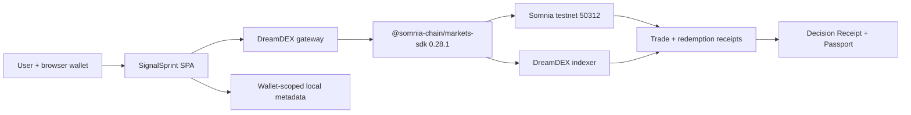

# SignalSprint: Winning Project Execution Plan

Last updated: 2026-08-31 (Asia/Kolkata)

[VERIFIED] Product direction from 2026-08-31 onward is superseded by `SIGNALSPRINT_V2_PLAN.md`. Read that file first. This file remains the implementation history, verified integration ledger, and record of the already-built DreamDEX lifecycle; do not follow its older wrapper-style product thesis when the two plans differ.

## 1. Mission and acceptance criteria

### Mission

[INFERRED] Build **SignalSprint**, a polished testnet trading coach that turns each short-duration DreamDEX Event Contract trade into a verifiable decision receipt: what the user chose, what price they paid, what happened at settlement, what they can redeem, and what the result says about their decision.

### Hackathon outcome

[INFERRED] The project is competitive when a judge can understand the user problem in one sentence, complete the core flow without help, see a real DreamDEX transaction and settlement path, and understand why users would return for another 15-minute or 1-hour round.

### Final acceptance criteria

- [ ] **AC1 — Live discovery:** The deployed app lists a real BTC or ETH Event Contract from DreamDEX testnet and shows asset, interval, expiry, Up/Down probability, and book state.
- [ ] **AC2 — Safe eligibility:** Before every trade, the app verifies on-chain status is `Trading` and rejects markets with less than 300 seconds remaining.
- [ ] **AC3 — Real execution:** A connected browser wallet places a real testnet IOC order through `@somnia-chain/markets-sdk`; the UI shows confirmed fill data and a transaction hash.
- [ ] **AC4 — Persistent lifecycle:** The round is keyed by `marketId`, survives reload, and visibly moves through Trading, Locked, Finalized or Voided, and Redeemed where applicable.
- [ ] **AC5 — Decision receipt:** A finalized round shows outcome, entry price, fill quantity, cost/max loss, result, score calculation, and evidence links without claiming statistical significance from one trade.
- [ ] **AC6 — Redemption:** The app detects a claimable winning outcome or both sides of a voided market and executes a real testnet redemption; losing outcomes are not redeemed.
- [ ] **AC7 — UX:** The happy path works at desktop and mobile widths, includes loading/empty/error states, uses plain-language risk copy, and exposes no private key.
- [ ] **AC8 — Verification:** Typecheck/build pass; unit tests cover scoring and lifecycle; the deployed flow is tested in a browser with screenshots and zero relevant console errors; real read, trade, and redemption evidence is saved.
- [ ] **AC9 — Submission:** Public repository, deployed testnet prototype, 2–3 minute video, concise README, architecture diagram, transaction evidence, and DoraHacks submission are complete before the internal deadline.
- [ ] **AC10 — Rubric proof:** The submission explicitly maps visible evidence to Innovation 20%, Technical 25%, UX 20%, Business/Ecosystem 20%, and Presentation 15%.

## 2. Verified event constraints

- [VERIFIED] Event: Somnia x DreamDEX Event Contracts Hackathon.
- [VERIFIED] Prize pool: $5,000 USDso.
- [VERIFIED] Portal timeline: submissions opened 2026-08-25 and the page displays a deadline of 2026-09-08 at 18:00.
- [ASSUMED] The displayed deadline timezone is the user's local timezone. Treat this as unresolved and submit at least 24 hours before the displayed deadline.
- [VERIFIED] Mandatory submission artifacts: working testnet prototype, GitHub repository, and 2–3 minute demo video.
- [VERIFIED] Optional artifacts: presentation deck and SDK/documentation feedback report.
- [VERIFIED] Judging weights: Technical Implementation 25%; Innovation & Originality 20%; User Experience & Design 20%; Business & Ecosystem Impact 20%; Presentation & Demo 15%.
- [VERIFIED] The organizer asks for meaningful DreamDEX Event Contract integration, meaningful API/SDK usage, clear UX, and potential for adoption or trading activity.

## 3. Why this concept was selected

### User problem

[INFERRED] Short-duration prediction trades give fast feedback, but the ordinary experience ends at win/loss. Users lack a compact after-action view that connects their decision, execution price, market outcome, redemption, and repeated learning.

### Product promise

> **Trade the call. Prove the edge. Learn before the next window.**

[INFERRED] SignalSprint converts a real 15-minute or 1-hour BTC/ETH market into a repeatable training loop:

`discover -> choose -> cap risk -> execute -> watch -> settle -> redeem -> review -> repeat`

### Demo money-shot

[INFERRED] A previously open position flips to Finalized, the result card reveals the on-chain outcome and market-relative score, the wallet redeems the winning position, and the user's Decision Passport updates in one visible sequence.

### Sponsor-essential test

[INFERRED] Removing DreamDEX destroys the product's core loop because live market discovery, executable probability, trade receipt, final outcome, position, and redemption all come from DreamDEX Event Contracts.

### Prior-art gap

- [VERIFIED] TellShots, Pick, Mashi, Proveya, WePredict, and similar products already offer social predictions, points, badges, or leaderboards.
- [VERIFIED] Previous Somnia winners stood out when the sponsor primitive caused a visible human consequence and the submission proved the full on-chain loop.
- [INFERRED] SignalSprint must therefore lead with **trade-to-settlement evidence and an execution postmortem**, not generic badges, a generic probability dashboard, or an unverifiable AI opinion.

## 4. Idea scorecard

Scores are 1–5. The weighted rubric score uses only the official five criteria. Demoability, feasibility, and differentiation are decision aids.

| Concept | Innovation 20 | Technical 25 | UX 20 | Business 20 | Demo 15 | Weighted /5 | Demoability | Feasibility | Differentiation |
|---|---:|---:|---:|---:|---:|---:|---:|---:|---:|
| **SignalSprint: decision receipt + trading coach** | 4.5 | 5.0 | 4.5 | 4.5 | 5.0 | **4.70** | 5 | 4 | 4 |
| Outcome Arcade: settlement controls a game | 4.5 | 4.0 | 4.5 | 4.0 | 5.0 | 4.35 | 5 | 3 | 4 |
| RiskBound Agent: user-approved AI trader | 4.0 | 4.5 | 4.0 | 4.0 | 4.0 | 4.13 | 4 | 3 | 3 |
| Lifecycle Cockpit: developer settlement console | 3.5 | 5.0 | 3.5 | 4.0 | 3.5 | 4.00 | 3 | 5 | 4 |
| Social Prediction Rooms | 3.0 | 3.5 | 4.5 | 4.5 | 4.5 | 3.95 | 5 | 4 | 2 |

[INFERRED] Recommendation: build SignalSprint because it naturally demonstrates the deepest SDK lifecycle while retaining a simple consumer story and a high-impact three-minute demo.

### Rejected traps

- [INFERRED] Generic dashboard: easy to copy, weak visible consequence.
- [INFERRED] Fully autonomous trading agent: crowded, safety-sensitive, and hard to evaluate reliably in the remaining time.
- [INFERRED] Multiplayer-first game: backend/auth/synchronization work competes with sponsor integration.
- [INFERRED] Custom market creation: outside the documented core challenge and unnecessary for the selected user loop.
- [INFERRED] Mainnet launch: contradicts the required testnet prototype and adds financial/legal risk.

## 5. Product definition

### Primary persona

[INFERRED] A crypto-curious user who understands Up/Down but wants a bounded way to practice timing and review decisions without operating a bot or reading raw chain data.

### Core jobs

1. Find the safest currently tradable BTC/ETH window.
2. Understand the probability, time remaining, and maximum loss before signing.
3. Place a small testnet position with minimal friction.
4. Return after expiry and immediately understand what happened.
5. Redeem a winner and compare the decision with the market snapshot.
6. Build a history of evidence-backed rounds and repeat.

### MVP features — mandatory

1. **Sprint Lobby**
   - Live BTC/ETH markets only.
   - 15-minute and 1-hour filters when available.
   - Cards show Up/Down probability, spread/book availability, countdown, status, and a `Closing soon` lockout.
   - Select the market with sufficient liquidity and at least 300 seconds of headroom.

2. **Decision Composer**
   - Choose Up or Down.
   - Optional self-reported confidence and one thesis tag: Trend, Reversal, Order book, News, or Instinct.
   - Choose a small testnet size within an app cap.
   - Show estimated cost, maximum loss, expiry, expected payout if correct, and testnet-only disclosure.
   - Confidence and thesis are clearly labeled user-entered metadata, not on-chain facts.

3. **Execution Receipt**
   - Refresh authoritative market status immediately before write.
   - Read current book and submit IOC.
   - Display submitted, confirmed, partially filled, filled, or failed states.
   - Persist `marketId`, wallet, outcome side, transaction hash, fill price/size, timestamp, and expiry.

4. **Live Round Tracker**
   - Timeline: Trading -> Locked -> Finalized/Voided -> Redeemed.
   - Show current position, countdown, and evidence link.
   - Poll/reconcile with a bounded deadline when the indexer trails the receipt.
   - Never infer lifecycle from countdown alone.

5. **Decision Receipt**
   - Reconstruct market outcome and user fills from chain/indexer data.
   - Show execution probability, realized outcome, P&L or payout, and scoring formula.
   - Compare the user's declared confidence with the result as a private learning aid.
   - Compare execution price with the market snapshot only when both values were actually captured.
   - Show sample size beside any aggregate score.

6. **Claim Center**
   - Find finalized markets with `listBinaryMarkets({ status: "Finalized" })`.
   - Check held outcome balances before redemption.
   - Redeem only the winner; on void, redeem both held sides.
   - Show the real redemption hash and updated collateral balance.

7. **Decision Passport**
   - Wallet-scoped round history reconstructed from real fills plus locally saved thesis metadata.
   - Summary: rounds, resolved rounds, win rate, total at-risk, realized result, average score, and calibration sample size.
   - Shareable visual card may be downloaded; it must label local/self-reported fields.

### Explicit non-goals — cut without debate

- No mainnet trading.
- No autonomous order placement.
- No custom token, NFT, or smart contract for the MVP.
- No global leaderboard, chat, referrals, or multiplayer rooms.
- No market-making strategy.
- No user-created markets.
- No push notifications or native mobile app.
- No AI-generated trade recommendation.
- No promise of profit, predictive accuracy, or financial advice.

### Stretch order — only after all MVP gates pass

1. Deterministic replay mode for a previously finalized real market.
2. Public read-only passport link backed by signed exported data.
3. AI-written postmortem generated only from verified structured fields, with no recommendation or autonomous action.
4. Private friend challenge using two wallet addresses.

## 6. Scoring specification

All formulas must be unit-tested and explained in the UI.

### Per-round values

- `y_up = 1` if Up wins, otherwise `0`; a void has no calibration score.
- If the user declares Up confidence `c`, `p_user_up = c`.
- If the user declares Down confidence `c`, `p_user_up = 1 - c`.
- `user_brier_loss = (p_user_up - y_up)^2`.
- `decision_score = round(100 * (1 - user_brier_loss))`.
- Convert the actual fill to Up probability: Up fill uses its fill price; Down fill uses `1 - down_fill_price`.
- `market_brier_loss = (p_entry_up - y_up)^2`.
- `market_relative_delta = market_brier_loss - user_brier_loss`.

### Display rules

- Positive market-relative delta means the user's declared probability was closer to this realized outcome than the execution-price probability for that one round.
- Never call a single positive delta “edge,” “skill,” or proof of future performance.
- Aggregate calibration appears only with the exact resolved sample count.
- Voided rounds show refund/redemption behavior and are excluded from win rate and calibration.
- Partially filled rounds score only the filled portion; zero-fill orders do not become completed rounds.

## 7. Technical architecture

### Architecture decision

[INFERRED] Use a client-first TypeScript single-page application with no required application backend. Public market data and history come from DreamDEX; the connected browser wallet signs writes through a `viem` WalletClient supported by the SDK. Local storage holds only presentation preferences and self-reported thesis metadata.



### Integration ownership boundaries

- `DreamDexGateway`: the only module allowed to import the markets SDK.
- `RoundRepository`: combines chain-derived round data with local user metadata; keys by wallet + `marketId`.
- `ScoringEngine`: pure deterministic functions; no network access.
- `RoundStateMachine`: converts verified market and receipt data into UI states.
- UI components: never call SDK methods directly and never contain chain constants.

### Verified SDK contract

`VERIFIED: @somnia-chain/markets-sdk — npm registry and installed-package tarball — version 0.28.1.`

- [VERIFIED] Install surface: `@somnia-chain/markets-sdk@0.28.1` with a compatible `viem` 2.x version selected and pinned after registry verification.
- [VERIFIED] Browser signing is supported through `walletClient`; the SDK also supports `setSigner(...)` after wallet connection.
- [VERIFIED] Live binary discovery: `exchange.client.listLiveBinaryMarkets(...)`.
- [VERIFIED] Authoritative status: `exchange.client.getMarketOnchain(marketId)`; status `1` is Trading.
- [VERIFIED] Book read: `exchange.fetchOrderBook(outcomeSymbol, depth)`.
- [VERIFIED] Taker execution: `exchange.createOrder(..., { timeInForce: "IOC" })`.
- [VERIFIED] Unified write receipt: read it from `order.info as PlaceOrderResult`, not `order.receipt`.
- [VERIFIED] User fills: `exchange.fetchMyTrades(...)` or the client fill surface after bounded indexer reconciliation.
- [VERIFIED] Finalized discovery: `exchange.client.listBinaryMarkets({ venueId, status: "Finalized" })`.
- [VERIFIED] Outcome balance: `exchange.client.getOutcomeBalance(...)`.
- [VERIFIED] Redemption: `exchange.trader.redeem(...)` with an explicit outcome index.
- [VERIFIED] Testnet collateral faucet exists through `exchange.trader.faucet()`; testnet collateral is tUSDC with 6 decimals.
- [VERIFIED] Core contract addresses are identical on chain IDs 50312 and 5031, but per-market contracts and pools must come from registry/SDK and never be hardcoded.

### Mandatory integration guards

1. Pin exact dependencies and commit the lockfile.
2. After installation, read `node_modules/@somnia-chain/markets-sdk/package.json` and record version/exports/types in `.codex/notes/VERIFIED.md` if writable.
3. Read installed type declarations before every first use of an SDK symbol.
4. Scope markets to the verified DreamDEX venue; resolve venue ID from live data or current sponsor config, never trust a stale copied constant.
5. Recheck on-chain status immediately before every write.
6. Reject less than 300 seconds of expiry headroom.
7. Use IOC for the consumer taker flow so no remainder rests invisibly.
8. Treat partial fill and zero fill as first-class outcomes.
9. Confirm receipt status and preserve transaction hash.
10. Poll indexer with a deadline after confirmation; never assume instant indexing.
11. Derive decimals and book parameters from the live venue/SDK; do not hardcode mainnet/testnet scales.
12. Key all durable state by `marketId`; pool addresses are recyclable.
13. Find winnings through finalized binary queries, not `loadMarkets()`.
14. Redeem a voided market on both held outcomes; do not infer a winner.
15. Close SDK watches/clients on teardown.
16. Never place a private key in frontend code, source control, logs, screenshots, or submission artifacts.

### Planned repository map

Framework-specific filenames may vary after the scaffold is verified, but ownership must remain:

```text
src/
  app/                    routes, providers, global layout
  components/             reusable visual primitives
  features/lobby/         market discovery and selection
  features/decision/      side, confidence, size, risk preview
  features/execution/     signing, receipt, fill reconciliation
  features/round/         lifecycle tracker and state machine
  features/review/        scoring and decision receipt
  features/passport/      wallet history and aggregate metrics
  lib/dreamdex/            SDK adapter, verified config, mappings
  lib/scoring/             pure formulas
  lib/storage/             versioned wallet-scoped metadata
  lib/format/              probability, token, time formatting
  test/                    fixtures and integration helpers
docs/
  evidence/                sanitized hashes, screenshots, test reports
  demo-script.md
```

### Round record

```text
schemaVersion
walletAddress
marketId
symbol
asset
intervalSec
expiry
side
declaredConfidenceBps       local/self-reported
thesisTag                   local/self-reported
orderTxHash                 on-chain
fillPrice                   chain/indexer
fillAmount                  chain/indexer
collateralCost              chain/indexer
committedAt                 receipt/indexer timestamp
status                      derived from authoritative market state
winningOutcome              chain
isVoided                    chain
redemptionTxHash            on-chain, optional
scoreVersion
```

## 8. UX and visual direction

[INFERRED] Use a focused sports-broadcast/editorial visual language: warm paper background, near-black ink, market green for Up/success, signal orange for urgency/Down, condensed display typography, and tabular numerals. Avoid purple gradients, generic dashboard grids, and decorative Web3 imagery.

### Primary screens

1. **Landing/Lobby:** one headline, one live recommended sprint, compact alternatives.
2. **Decision Sheet:** side, confidence, thesis tag, size, max-loss preview, one signing action.
3. **Live Sprint:** large countdown, position, lifecycle rail, transaction evidence.
4. **Result Reveal:** meaningful card-flip/reveal animation, outcome, payout, score, claim action.
5. **Passport:** concise history, calibration plot, totals, sample-size caveat.

### UX rules

- User sees the next action within three seconds.
- Wallet connection is deferred until the user chooses to trade; read-only browsing works first.
- Every signing request is preceded by a human summary of exactly what will happen.
- Testnet is always visible.
- Error copy explains whether the problem is wallet, status, liquidity, expiry, balance, or indexing.
- Animation is reserved for market selection, transaction progression, and result reveal.
- Mobile keeps the countdown, direction, max loss, and primary action above the fold.
- Accessibility: keyboard paths, visible focus, reduced-motion support, semantic status text, and color-independent Up/Down labels.

## 9. Build phases and gates

No phase starts until the previous exit gate is evidenced. Each implementation model updates the Progress Board and the evidence folder.

### Phase 0 — Workspace and dependency gate (Aug 29)

Tasks:

1. Inspect existing files, git status, runtime versions, and writable note locations.
2. Ask once for approval to add the minimal dependency set because the current workspace has no application dependencies.
3. Verify registry versions and official docs for the selected frontend scaffold, React, TypeScript, `viem`, test runner, and browser test runner.
4. Scaffold one TypeScript SPA only; no monorepo and no backend.
5. Install exact `@somnia-chain/markets-sdk@0.28.1`, compatible exact `viem` 2.x, and exact verified frontend/test packages.
6. Record every verification line in `.codex/notes/VERIFIED.md` if writable; otherwise append to this file's Verified Ledger.
7. Add formatting, typecheck, unit-test, build, and browser-test commands.

Exit gate:

- Clean app opens locally.
- Typecheck, unit-test placeholder, and production build commands run.
- Installed package versions and scripts are pasted into evidence.
- No unverified import, SDK call, config key, env name, RPC, address, or chain value exists.

### Phase 1 — Read-only DreamDEX vertical slice (Aug 30)

Tasks:

1. Implement verified chain/indexer/address configuration behind `DreamDexGateway`.
2. Instantiate a read-only exchange.
3. Query live binary markets, scope to the current DreamDEX venue, and select BTC/ETH markets.
4. Query authoritative on-chain status per candidate.
5. Read best bid/ask and render one real market card.
6. Add empty, no-liquidity, RPC, indexer, and closing-soon states.
7. Add a diagnostics panel available only in development.

Exit gate:

- Real request output shows at least one market ID, asset, interval, expiry, status, and book state.
- Browser screenshot shows the same live market.
- Console has no relevant errors.
- Unit tests cover candidate selection and expiry filtering.

### Phase 2 — Wallet and real IOC execution (Aug 31)

Tasks:

1. Build browser wallet connection using a verified `viem` WalletClient path supported by the installed SDK.
2. Validate Somnia testnet chain ID 50312 and provide an explicit network-switch instruction/state.
3. Add tUSDC/STT balance preflight; expose faucet only through a deliberate testnet action.
4. Implement decision composer and risk preview.
5. Immediately re-fetch `getMarketOnchain` before write.
6. Read the latest book, quantize through the SDK, and submit IOC.
7. Parse `PlaceOrderResult` from `order.info`; handle confirmed, reverted, partial fill, and zero fill.
8. Persist the round under wallet + `marketId`.

Exit gate:

- A real testnet trade confirms from the browser wallet.
- Evidence includes market ID, sanitized wallet address, transaction hash, receipt status, requested amount, and actual fill.
- Reload restores the active round.
- No private key is used or logged.

### Phase 3 — Lifecycle, finalization, and redemption (Sep 1)

Tasks:

1. Implement explicit lifecycle states and transitions from authoritative data.
2. Reconcile confirmed fills after indexer delay with capped retries and timeout UI.
3. Query finalized markets using the binary finalized surface.
4. Match finalized records by `marketId`, never pool.
5. Read resolution and outcome balances.
6. Implement claim eligibility for winner or both voided sides.
7. Execute redemption and refresh balances/history.
8. Capture one complete real market from trade through redemption; if waiting is required, use a 15-minute window.

Exit gate:

- Real output proves Finalized or Voided detection.
- Real redemption receipt is captured for a held claimable outcome.
- Losing-side redemption is prevented in UI and covered by test.
- Voided handling is covered by fixture/unit test even if no real void is available.

### Phase 4 — Decision Receipt and Passport (Sep 2)

Tasks:

1. Implement pure scoring functions from Section 6.
2. Build result reveal and evidence panel.
3. Reconstruct wallet history from real fills/finalized markets.
4. Merge local thesis metadata by wallet + `marketId` without overwriting chain facts.
5. Build aggregate metrics with sample-size labels and void exclusions.
6. Add share-card export only if it does not threaten core gate completion.

Exit gate:

- Golden fixtures prove Up win, Down win, loss, partial fill, zero fill, and void math.
- Passport reconstructs after clearing in-memory state.
- Every displayed number traces to a source field or documented formula.

### Phase 5 — Product polish and resilience (Sep 3–4)

Tasks:

1. Apply the visual direction and responsive layouts.
2. Add intentional load/stagger/reveal motion and reduced-motion behavior.
3. Test keyboard navigation, focus, contrast, mobile viewport, and text overflow.
4. Add retry/recovery for wallet rejection, wrong network, no balance, no liquidity, locked market, reverted transaction, indexer lag, and stale local record.
5. Add a replay route backed by a previously captured real finalized market for a deterministic judge demo.
6. Ensure replay is labeled and never presented as a new live transaction.

Exit gate:

- Desktop and mobile browser screenshots exist for all five primary screens.
- No relevant console errors.
- Happy path can be completed without verbal guidance.
- Replay uses real immutable market/transaction evidence.

### Phase 6 — Full proof and bug fixing (Sep 5)

Tasks:

1. Run typecheck, unit tests, production build, and browser E2E.
2. Call every API/SDK path used by the demo and save concise real output.
3. Run the live happy path and replay fallback.
4. Test original acceptance criteria one by one.
5. For any bug: capture full error, state 2–3 hypotheses, add a temporary `[dbg]` probe, run it, fix only the confirmed cause, remove probe.
6. If the same bug fails twice, stop and prepare a deep-profile handoff.

Exit gate:

- AC1–AC8 are checked with evidence.
- No P0/P1 bugs; no unresolved demo-path P2 bugs.
- Build artifact and deployed artifact match.

### Phase 7 — Submission package (Sep 6)

Tasks:

1. Write README: problem, solution, why DreamDEX is essential, architecture, setup, verified stack, lifecycle safety, test evidence, limitations, and roadmap.
2. Add exact testnet evidence: market IDs, transaction hashes, explorer links, screenshots, and redemption proof.
3. Write a one-page SDK feedback report with reproducible issues only.
4. Write demo script and shot list from Section 10.
5. Record first video draft; trim to 2–3 minutes.
6. Prepare DoraHacks copy against the rubric.

Exit gate:

- A new reader can run the app from README without private information.
- Video draft includes problem, live product, real proof, architecture, and repeat-use vision.
- All claims in the submission are either verified or clearly framed as future work.

### Phase 8 — Freeze, audit, submit (Sep 7; internal deadline)

Tasks:

1. Feature freeze. No dependency upgrade, refactor, or stretch feature.
2. Re-run complete verification on deployed URL.
3. Perform disqualification audit: public repo, working testnet URL, 2–3 minute video, correct links, no secrets, no broken explorer links.
4. Record final video only if draft has a concrete defect.
5. Submit at least 24 hours before the portal's displayed deadline.
6. Save submission confirmation locally.

Exit gate:

- AC1–AC10 checked.
- Submission confirmation captured.
- Final state and known limitations written for future models.

## 10. Three-minute demo script

Target length: 2:30–2:45. Never depend on a market expiring during the recording.

### 0:00–0:15 — Problem

“Prediction trades tell you whether you won. They rarely tell you what your decision cost, whether your confidence matched reality, or what to learn before the next market. SignalSprint turns every DreamDEX Event Contract into a verifiable training round.”

### 0:15–0:40 — Live market discovery

- Open live lobby.
- Show BTC/ETH, 15m/1h, Up/Down probabilities, countdown, and on-chain Trading badge.
- Mention that closing markets are automatically rejected.

### 0:40–1:10 — Decision and trade

- Choose direction, confidence, thesis tag, and small testnet size.
- Show maximum loss and expected payout.
- Sign once with browser wallet.
- Show confirmed transaction hash and actual fill.

### 1:10–1:50 — Settlement money-shot

- Switch to the labeled replay of a previously captured real finalized round.
- Animate Trading -> Locked -> Finalized.
- Reveal outcome, score, fill, cost, and evidence.
- Click Claim and show the real redemption proof or a previously confirmed claim if live claiming was already completed.

### 1:50–2:15 — Passport and technical proof

- Show wallet history reconstructed by market ID.
- Show sample-size-aware metrics.
- Open evidence drawer: SDK 0.28.1, market ID, order hash, redemption hash.

### 2:15–2:40 — Why it matters

“Fifteen-minute and one-hour rounds create a repeat loop: decide, trade, settle, learn, repeat. Every loop creates real DreamDEX activity while making Event Contracts understandable to a new user.”

### Demo fallback hierarchy

1. Live testnet discovery + live small trade + prerecorded finalized replay.
2. Live discovery + previously confirmed trade receipt + finalized replay.
3. Deployed read-only app + real saved order/redemption evidence.

[INFERRED] The fallback protects timing and liquidity risk; it does not replace the requirement to complete and prove the full flow before recording.

## 11. Verification matrix

| Area | Required proof | Pass condition |
|---|---|---|
| SDK version | installed package.json | exactly 0.28.1 |
| Market discovery | real output + screenshot | current binary market shown |
| Status guard | test + live log | write blocked unless status 1 |
| Expiry guard | unit + UI | less than 300s blocked |
| Book | real output | bid/ask or explicit no-liquidity state |
| Trade | wallet + receipt | successful real testnet tx |
| Partial/zero fill | fixture or real result | distinct UI and no false completed round |
| Persistence | reload browser | round restored by wallet + marketId |
| Finalized lookup | real output | finalized market found outside live list |
| Scoring | golden unit tests | exact expected values |
| Claim eligibility | unit + live balance | only valid held outcomes enabled |
| Redemption | real receipt | collateral changes or claim recorded |
| Responsive UX | browser screenshots | desktop + mobile usable |
| Accessibility | keyboard/reduced motion | core flow usable |
| Console | browser logs | zero relevant errors |
| Production | typecheck/test/build | all commands exit 0 |
| Deployment | deployed E2E | same happy path works |

## 12. Risk register

| Risk | Trigger | Mitigation | Owner phase |
|---|---|---|---|
| No liquidity | empty book | choose another live market; use disclosed separate-wallet sponsor maker only if required; keep real finalized replay | 1–3 |
| Self-match blocked | maker and taker same wallet | never use one wallet for both sides | 2 |
| Market locks mid-flight | status changes near expiry | 300s headroom + immediate pre-write status read | 1–2 |
| Indexer lag | receipt confirms but fill missing | receipt-first UI + bounded reconciliation polling | 2–3 |
| SDK drift | docs/source mismatch | exact 0.28.1 pin + installed type inspection; source wins | 0 |
| Stale venue ID | zero/mixed markets | resolve from live market/current sponsor config; never silently guess | 1 |
| Wallet incompatibility | injected signer fails | spike browser WalletClient before UI work | 2 |
| No test funds | low STT/tUSDC | tUSDC faucet; request STT through official hackathon community channel | 2 |
| Redemption timing | no held finalized winner | start 15m evidence run early and capture multiple small rounds | 3 |
| Demo dependency on live expiry | recording stalls | labeled replay from real finalized evidence | 5 |
| Gamification criticism | product appears to encourage risky behavior | testnet-only, capped size, max-loss-first UX, no profit claims, learning framing | all |
| Scope explosion | request for AI/social/custom contract | enforce non-goals until AC1–AC8 pass | all |
| Deadline timezone | portal display ambiguous | verify with organizer; internal submit Sep 7 | 7–8 |

## 13. Rubric strategy

### Technical Implementation — 25%

- Real market discovery, book read, browser-wallet IOC execution, receipt parsing, lifecycle tracking, finalized query, balance read, and redemption.
- Correct handling of indexer lag, expiry, tick/lot precision, partial fills, voids, and recycled pools.
- Evidence: real hashes, tests, explorer links, and architecture boundary.

### Innovation & Originality — 20%

- Event Contract is not merely displayed; its full lifecycle becomes a rapid decision-feedback product.
- Market-relative postmortem and verifiable trade-to-redemption receipt distinguish the app from generic social predictions.

### User Experience & Design — 20%

- One-screen next action, max-loss-first decision, plain language, result reveal, passport, mobile path, accessibility, and graceful failure states.

### Business & Ecosystem Impact — 20%

- Repeat loop matches DreamDEX's short market cadence and can generate recurring trading and redemption activity.
- Read-only discovery lowers first-use friction; training framing makes the primitive understandable to new users.
- Future product path: signed public passports, team challenges, creator cohorts, and optional explainable postmortems.

### Presentation & Demo — 15%

- Problem in 15 seconds, real transaction in the first half, settlement money-shot, proof drawer, and one-sentence repeat-use story.

## 14. Model operating procedure

Every future model must follow this sequence:

1. Read this file and `EVENT_CONTRACTS_HACKATHON_FINDINGS.md`.
2. Read `.codex/notes/STATE.md`, `VERIFIED.md`, and `DECISIONS.md` if the directory becomes writable/available.
3. Restate the current phase goal and acceptance criteria with confidence tags.
4. Inspect all relevant existing patterns before editing.
5. If more than two files are required, present the ordered file plan and wait for user approval.
6. Verify every external symbol/config/version from installed source or current official docs; emit `VERIFIED: thing — source — version` before code.
7. Build the smallest end-to-end slice for the current phase.
8. Run the phase gate; paste concise evidence.
9. Re-read changed files.
10. Update Progress Board, Verified Ledger, Decision Log, and next three steps.
11. Stop at the phase boundary. Research, build, and debug should not be mixed into an uncontrolled session.

### Handoff format

```text
CURRENT PHASE:
GOAL:
ACCEPTANCE CRITERIA:
FILES CHANGED:
VERIFIED FACTS ADDED:
COMMANDS RUN + RESULTS:
REAL CHAIN/API EVIDENCE:
OPEN BUGS:
NEXT 3 STEPS:
DO NOT CHANGE:
```

## 15. Progress Board

### Works — verified

- [x] Official event rules, submission artifacts, deadline display, and judging weights were read from the rendered DoraHacks page on 2026-08-29.
- [x] DreamDEX developer, recipes, gotchas, contracts, and sponsor bot-kit sources were inspected on 2026-08-29.
- [x] npm registry latest version for `@somnia-chain/markets-sdk` was verified as 0.28.1 on 2026-08-29.
- [x] Five concepts were compared against the official rubric; SignalSprint was selected.
- [x] Execution plan saved.
- [x] React/Vite TypeScript scaffold created with exact dependency pins.
- [x] `npm run build` passed after fixing the verified TypeScript import issue.
- [x] `npm test` passed with 1 test.
- [x] Browser screenshot verified desktop rendering and clean console after fixing accent-card contrast.
- [x] Read-only DreamDEX gateway uses SDK 0.28.1 testnet config and live indexer data.
- [x] On-chain status guard filters stale/finalized rows before they appear tradable.
- [x] Browser shows live BTC/ETH market cards, closing countdowns, market IDs, and book/no-liquidity state with clean console.
- [x] Pure decision helpers cover five-minute eligibility, raw book normalization, empty books, and case-insensitive market identity.
- [x] Gateway applies the five-minute eligibility rule before rendering tradable candidates.
- [x] Browser regression renders the empty-live-market state after windows advance, with no console errors.
- [x] Review fixed raw book integers, indistinguishable market IDs, misleading book coverage, and first-eight candidate selection.
- [x] Decision Composer opens from a live market and previews Up/Down cost, maximum loss, profit, payout, confidence, and thesis metadata.
- [x] Composer browser path was exercised for outcome, amount, close, and clean console; confidence pointer interaction remains to be retested.
- [x] Browser wallet connection spike uses verified viem WalletClient APIs and never submits a transaction.
- [x] Missing-wallet state is explicit and tested in-browser; chain mismatch handling now registers Somnia with `wallet_addEthereumChain` before retrying the switch.
- [x] Wallet connection attempt in the current in-app browser safely reported no injected provider; account/chain/balance/transaction access remained at zero.
- [x] Chain-switch fallback compiles and the live composer remains clean in browser verification; connected-wallet approval remains unverified because no eligible market was available during the wallet-tab check.
- [x] Phase 2 trade action is implemented: market-ID/on-chain/book revalidation, STT/tUSDC preflight, bounded IOC write, receipt/fill display, explorer link, and retryable errors.
- [x] Reviewed the live `ImmediateOrCancelNoFill()` report: execution now reads the on-chain four-sided book immediately before writing, derives BUY_NO from the actual NO ask, and maps a race to retry guidance.
- [x] Replaced the SDK max-allowance path with zero-then-exact collateral approval; existing excess allowance is reduced before exact approval is requested.
- [x] User browser evidence confirms the approval sequence now revokes the previous allowance and approves a bounded amount; no unlimited approval remains after the retry.
- [x] Deep IOC diagnostic confirmed the order uses the exact best ask with no protective cushion. SDK 0.28.1 states that one tick of book churn then leaves the IOC uncrossable and produces a zero fill; a read-only live probe measured a `0.001` tick and SDK cushions of `0.010` to `0.022` across current BTC/ETH markets.
- [x] Protected IOC implementation walks ten on-chain ask levels, requires full requested depth, applies SDK slippage and tick alignment, maps BUY_NO into YES terms, and approves the padded escrow exactly.
- [x] Regression validation passed: `npm test -- --run` = 10 tests passed; `npm run build` = passed; `git diff --check` = passed; browser composer = rendered with no error-level console logs.
- [x] Decoded failed tx `0x67856c282d2d32eae34ce834f3fc1994a2e4b5bc3fde7a9daba1cbca4fa7faf0`: BUY_NO submitted YES price `566000` (NO cap `434000`), while the mined-block YES bid was `512000` (NO ask `488000`), proving the pre-approval quote became stale.
- [x] IOC execution now approves a finite cap of at most `1 tUSDC × contract count`, then revalidates the market and rebuilds the protected on-chain quote after approval immediately before order signing.
- [x] Post-approval re-quote validation passed: historical failed-block regression produces YES price `497000` (NO cap `503000`); `npm test -- --run` = 12 tests passed; build and diff check passed; browser composer rendered with no error-level console logs.
- [x] Live wallet proof completed: tx `0xac29449bacdc744af7f1165be031c3511ce9dfe47530133edf378d4633868f6a` succeeded at block `475502607`; BUY_NO IOC quantity `1000000` filled completely with taker remainder `0` and an `OrderFilled` event.
- [x] Successful tx pool `0x610fa91fe8185685fc1e8fa15429747ca189433b` maps to the live BTC 15m market `0x...e3a0`; the explorer receipt is linked in the verified ledger below.
- [x] Phase 3 settlement implementation added: authoritative lifecycle snapshot, held UP/DOWN outcome balances, explicit winner/void claim guard, wallet redemption write, and redemption receipt link.
- [x] Live finalized-query probe returned five `Finalized` markets; the successful BTC 15m market `0x...e3a0` is resolved with UP winning and the wallet holds only the losing DOWN balance, so no redemption is offered.
- [x] Regression validation passed after Phase 3 implementation: `npm test -- --run` = 14 tests passed; `npm run build` = passed; browser composer rendered with zero error-level console logs.
- [x] Wallet-scoped receipt history is chain-backed: `getPortfolio(account, { tradesLimit: 200 })` imports prior fills, joins them to live markets by `marketAddress`, merges them with local receipts by wallet + `marketId`, and opens a separate settlement review with the same claim guard.
- [x] Real winning redemption proof completed: tx `0x5eb9f2...a53d30e` succeeded and emitted `Redeemed` for UP/YES, burning `5000000` outcome units and paying `5000000` collateral units to the connected wallet.
- [x] Phase 4 scoring slice added: pure Brier-based decision score, market-relative delta, WIN/LOSS/VOID/PENDING/NO_FILL states, confidence/thesis capture for new local receipts, and a wallet-scoped passport summary with sample-size labeling.
- [x] Phase 4 settlement hydration added: imported wallet fills now batch-read authoritative settlement snapshots by `marketId`, allowing resolved sample counts and win rate to reconstruct after reload while preserving local confidence/thesis metadata.
- [x] Deterministic judge replay added: the public lobby shows the verified ETH 15m market `0x...e3fb`, fill tx `0x64a656...f099`, and redemption tx `0x5eb9f2...d30e` as read-only evidence; it never counts as a new trade.
- [x] Settlement-derived receipt fields now persist during history hydration and review: stage, resolution flags, winning outcome, checked time, decision result, score, and market-relative delta are stored without overwriting local confidence/thesis metadata.

### In progress

- [x] Phase 2 — live wallet signature and real IOC execution proof.
- [x] Phase 3 — real winning redemption receipt and post-claim balance refresh.
- [x] Phase 4 slice — scoring fixtures, review result reveal, and fill-based passport summary.
- [x] Correct the IOC quote — walk enough live ask depth for the requested size, apply the SDK's tick-aligned protective crossing price, and approve only the resulting bounded collateral.

### Next three steps

1. Capture desktop/mobile screenshots and finalize the 2–3 minute demo script.
2. Prepare the README, SDK feedback, exact transaction evidence, and final submission audit.
3. Run the full AC1–AC10 submission audit and freeze the feature set.

### Landmines

- `.codex/notes/` was unavailable at planning time; this file temporarily carries state, verification, and decisions.
- Do not copy the old bot-kit test report's SDK 0.22 guidance; current official docs and package source use 0.28.1.
- Do not trust a venue ID copied from an old example without resolving current live scope.
- Do not use `loadMarkets()` to find settled winnings.
- Do not read a receipt from `order.receipt`; unified result wraps it in `order.info`.
- Do not key history by pool address.
- The dev server used port 5174 because port 5173 was already occupied during browser verification.

## 16. Verified Ledger

- `Event deadline display = 2026-09-08 18:00` | source: official DoraHacks rendered page | checked 2026-08-29.
- `Submission = working testnet prototype + GitHub repository + 2–3 minute video` | source: official DoraHacks rendered page | checked 2026-08-29.
- `Judging = Innovation 20 / Technical 25 / UX 20 / Business 20 / Presentation 15` | source: official DoraHacks rendered page | checked 2026-08-29.
- `@somnia-chain/markets-sdk latest = 0.28.1` | source: npm registry | checked 2026-08-29.
- `SDK browser signer = walletClient; signer may be replaced with setSigner` | source: package 0.28.1 `src/trade.ts` and `src/unified/exchange.ts` | checked 2026-08-29.
- `SDK unified receipt = order.info as PlaceOrderResult` | source: official DreamDEX Event Contracts docs/recipes | checked 2026-08-29.
- `status 1 = Trading; chain status beats indexer` | source: official DreamDEX docs/gotchas/recipes | checked 2026-08-29.
- `taker flow = IOC` | source: official DreamDEX docs/recipes | checked 2026-08-29.
- `settled lookup = listBinaryMarkets status Finalized` | source: official DreamDEX docs/recipes | checked 2026-08-29.
- `redemption = trader.redeem explicit outcome index` | source: official DreamDEX docs/recipes | checked 2026-08-29.
- `testnet chain ID = 50312; collateral = tUSDC 6 decimals` | source: official DreamDEX contracts page | checked 2026-08-29.
- `pools recycle; state key = marketId` | source: official DreamDEX gotchas page | checked 2026-08-29.
- `React = 19.2.8; React DOM = 19.2.8; Vite = 8.2.2; plugin-react = 6.1.1; TypeScript = 6.0.2; Vitest = 4.1.11; viem = 2.56.0` | source: npm registry; Vite/Vitest official Context7 docs | checked 2026-08-30.
- `Vite React TS entry = createRoot + StrictMode; config = defineConfig({ plugins: [react()] }); build = tsc -b && vite build` | source: official Vite template/docs via Context7 | checked 2026-08-30.
- `scaffold build = passed; tests = 1 passed; browser console = clean` | source: local command output and `/tmp/signalsprint-desktop-fixed.png` | checked 2026-08-30.
- `live binary query = returned current BTC/ETH markets; on-chain guard removed stale Finalized rows; order-book tops returned both empty and populated states` | source: local SDK probe and browser DOM/screenshot | checked 2026-08-30.
- `production build = passed with SDK bundle-size warning; tests = 1 passed; git diff --check = passed` | source: local command output | checked 2026-08-30.
- `decision helpers = 4 new cases passed; full tests = 5 passed; gateway build = passed` | source: local Vitest and Vite output | checked 2026-08-31.
- `browser regression = empty-live-market state rendered after testnet windows advanced; console errors/warnings = []` | source: local browser DOM and dev logs | checked 2026-08-31.
- `Phase 1 exit = live 15m BTC/ETH cards, populated books, diagnostics scanned 8 / eligible 2 / book coverage 2/8, browser console errors/warnings []` | source: local browser DOM, screenshot, and dev logs | checked 2026-08-31.
- `reviewed lobby = 15m/1h BTC/ETH selection; probability-scale books; distinct ID suffixes; accurate populated-book coverage` | source: local browser DOM and screenshot | checked 2026-08-31.
- `Decision Composer = Up/Down and amount update risk preview; close restores lobby; browser console errors/warnings []` | source: local browser interaction and screenshot | checked 2026-08-31.
- `viem wallet surface = createWalletClient/custom/requestAddresses/getChainId/switchChain; SDK signer = setSigner({ walletClient })` | source: installed viem 2.56.0 and markets-sdk 0.28.1 type/source files | checked 2026-08-31.
- `wallet connection spike = compiled; missing injected wallet rendered explicit install-wallet error; transaction count = 0; console errors/warnings = []` | source: local browser interaction and dev logs | checked 2026-08-31.
- `in-app wallet attempt = no injected window.ethereum provider; live composer still rendered; no account, chain, balance, or transaction accessed` | source: local browser DOM | checked 2026-08-31.
- `chain-switch fallback = wallet_addEthereumChain uses somniaShannon metadata, then retries switchChain; build = passed; tests = 6 passed; isolated browser console = clean` | source: local source, installed viem types, npm output, and browser dev logs | checked 2026-08-31.
- `IOC action = verified SDK low-level placeOrder path with marketId revalidation, live book check, STT/tUSDC preflight, receipt/fill result, and explorer link; build = passed; tests = 7 passed` | source: local source, installed SDK 0.28.1 types/source, npm output | checked 2026-08-31.
- `wallet-enabled browser tab = connected tab claim succeeded; current market query returned scanned 16 / checked 4 / eligible 0; console errors/warnings = []` | source: user in-app browser DOM and dev logs | checked 2026-08-31.
- `ImmediateOrCancelNoFill diagnosis = prior path used an indexer top and stale prices could race the write; current path reads getBinaryOrderBook at chain head and maps no-fill to retry guidance` | source: user screenshot, installed SDK 0.28.1 source, and local gateway implementation | checked 2026-08-31.
- `approval safety = current path reads allowance, resets non-exact positive allowance to zero, approves exactly required collateral, waits for both receipts, then places with autoApprove=false` | source: installed SDK 0.28.1 approval source, viem 2.56.0 erc20Abi/writeContract/waitForTransactionReceipt types, and local gateway implementation | checked 2026-08-31.
- `latest user retry = wallet activity shows Revoked spending cap + Approved spending cap, followed by Interaction failed; app reports ImmediateOrCancelNoFill retry guidance; no position was created` | source: user browser screenshot | checked 2026-08-31.
- `ImmediateOrCancelNoFill root cause = gateway submits the exact top price with zero headroom; SDK says one tick of churn makes that IOC uncrossable; live grid probe found tick 1000 and protective gaps 10000-22000 raw quote units` | source: installed SDK 0.28.1 `src/derivedReads.ts`, local `gateway.ts`, and read-only Somnia testnet probe | checked 2026-08-31.
- `protected IOC implementation = fixed quantity walks depth 10, requires full fillable depth, pads the deepest level with SDK slippage, snaps upward to tickSize, converts BUY_NO to YES terms, and exact-approves padded collateral` | source: local `decision.ts`, `gateway.ts`, `decision.test.ts`, installed SDK 0.28.1 source | checked 2026-08-31.
- `protected IOC validation = tests 10 passed, build passed, diff check passed, browser composer rendered with no error-level console logs` | source: local npm output and browser DOM/screenshot/dev logs | checked 2026-08-31.
- `failed tx 0x67856c...faf0 = placeBinaryOrder kind 2 BUY_NO, YES price 566000, quantity 5000000, IOC type 2, reverted at block 475485975; block top YES bid 512000 means NO ask 488000, above submitted NO cap 434000` | source: Somnia RPC transaction/receipt/calldata and historical getBookLevels reads | checked 2026-08-31.
- `post-approval re-quote fix = finite approval cap min(wallet tUSDC, 1 tUSDC per contract), followed by fresh market/book/grid read and protected quote before placeOrder; historical regression returns YES 497000 / NO cap 503000` | source: local `gateway.ts`, `decision.ts`, and `decision.test.ts` | checked 2026-08-31.
- `post-approval re-quote validation = tests 12 passed, build passed, diff check passed, browser composer rendered with no error-level console logs` | source: local npm output and browser DOM/screenshot/dev logs | checked 2026-08-31.
- `successful live tx 0xac2944...8f6a = receipt success at block 475502607; placeBinaryOrder kind 2 BUY_NO, quantity 1000000, IOC type 2; OrderFilled quantity 1000000, takerRemainingQuantity 0, fillPrice 971000; pool 0x610fa9...943b maps to BTC 15m market 0x...e3a0` | source: read-only Somnia RPC transaction/receipt/calldata/event decoding and live pool-to-market query | checked 2026-08-31.
- `Phase 3 implementation = loadSettlement reads status/resolution and ERC-6909 UP/DOWN balances; redeemSettlement rechecks state and only signs an explicit winning or voided held outcome` | source: local `gateway.ts`, `decision.ts`, `MarketLobby.tsx`, official recipes | checked 2026-08-31.
- `finalized settlement probe for 0x...e3a0 = status 4 / resolved true / voided false / winningOutcome 0 / wallet UP 0 / DOWN 1000000` | source: read-only Somnia RPC `getMarketOnchain` and `getOutcomeBalance` query for the successful-trade wallet | checked 2026-08-31.
- `finalized-query probe = live venue returned 5 finalized binary markets; sample market 0x...e3d5 had status Finalized` | source: read-only Somnia SDK `listBinaryMarkets({ venueId, status: "Finalized" })` query | checked 2026-08-31.
- `receipt history = chain portfolio imports prior fills and joins all four live wallet fills to market IDs; local receipts remain a fallback and duplicate merge key is tx hash + marketId + outcome` | source: official DreamDEX portfolio recipe, installed SDK 0.28.1 source, live indexer probe, and local `MarketLobby.tsx` | checked 2026-08-31.
- `history integration = wallet connect loads local receipts immediately, then merges chain portfolio fills; final tests = 14 passed, build = passed, browser market board rendered, console errors/warnings = []` | source: local `MarketLobby.tsx`, npm output, and browser smoke check | checked 2026-08-31.
- `winning redemption proof = tx 0x5eb9f2...a53d30e succeeded with Redeemed(outcomeIdx=0, amountBurned=5000000, collateralOut=5000000) paid to 0x87c4...eE89` | source: Somnia RPC receipt and installed SDK `binarySettlementEventsAbi` | checked 2026-08-31.
- `Phase 4 scoring = evaluateDecisionScore implements the documented Brier formula and buildPassportMetrics excludes void/unresolved/no-fill rounds from resolved samples; tests = 17 passed, build = passed` | source: local `decision.ts`, `decision.test.ts`, plan scoring specification, and npm output | checked 2026-08-31.
- `settlement hydration = live wallet portfolio returned 5 fills; all 5 joined to authoritative finalized snapshots by marketId, including the redeemed market with zero remaining balance` | source: installed SDK 0.28.1 read-only probe against Somnia RPC/indexer | checked 2026-08-31.
- `deterministic replay = public browser renders the verified ETH 15m fill and redemption receipts with DEMO REPLAY / READ ONLY labels; no wallet required; console errors/warnings = []` | source: local `MarketLobby.tsx`, browser DOM/screenshot, and dev logs | checked 2026-08-31.
- `settlement persistence = hydrated and manually reviewed records save chain-derived lifecycle/result fields while preserving confidence/thesis metadata; tests = 17 passed, build = passed` | source: local `MarketLobby.tsx`, `gateway.ts`, and npm output | checked 2026-08-31.

## 17. Decision Logtorical rounds, then the deterministic replay fixture.

- Select SignalSprint because it combines a simple consumer loop with the deepest judge-visible DreamDEX lifecycle. Rejected generic social leaderboard because prior art is crowded. 2026-08-29.
- Use a client-first SPA and browser wallet because SDK 0.28.1 supports WalletClient and this avoids custody/backend key risk. Rejected server private key. 2026-08-29.
- Keep self-reported confidence/thesis local and label it because the MVP has no trusted timestamping contract. Rejected unverifiable “fully on-chain confidence” claim. 2026-08-29.
- Make AI optional after the verified core because generic AI trading agents are crowded and add reliability/cost risk. Rejected AI as the MVP dependency. 2026-08-29.
- Build testnet only because the hackathon requires a testnet prototype and real-money deployment adds unnecessary risk. 2026-08-29.
- Use real finalized-market replay for demo determinism while retaining real live discovery/trading evidence. Rejected waiting for live expiry during the video. 2026-08-29.
- Use TypeScript 6.0.2 instead of registry-latest 7.0.2 because the current official Vite React template documents the 6.0.2 line. Rejected unverified compiler-latest compatibility. 2026-08-30.
- Cap the pre-signature decision preview at 10 outcome contracts to keep the practice flow bounded. Rejected an uncapped amount because it weakens the product's risk-control promise. 2026-08-31.

## 18. Unknowns that must be resolved early

- [ASSUMED] Deadline timezone. Verify with organizer; internal deadline remains Sep 7 regardless.
- [VERIFIED] Current public testnet indexer is `https://dev.smk.somnia.host/v1/graphql`; live venue IDs are returned by the indexer and are not hardcoded.
- [ASSUMED] Which injected wallets work reliably with Somnia testnet and SDK WalletClient in the final browser. Spike in Phase 2.
- [ASSUMED] Current testnet liquidity. Measure before selecting the demo market and prepare a disclosed separate-wallet maker only if needed.
- [ASSUMED] Frontend scaffold and test package versions. Verify registry/docs and obtain dependency approval in Phase 0.

## 19. Primary sources

- Hackathon details: https://dorahacks.io/hackathon/event-contracts/detail
- Hackathon projects: https://dorahacks.io/hackathon/event-contracts/buidl
- DreamDEX Event Contracts: https://docs.dreamdex.io/developers/event-contracts
- DreamDEX recipes: https://docs.dreamdex.io/developers/event-contracts/recipes
- DreamDEX gotchas: https://docs.dreamdex.io/developers/event-contracts/gotchas
- DreamDEX contracts/addresses: https://docs.dreamdex.io/developers/event-contracts/contracts-and-addresses
- Sponsor bot-kit: https://github.com/somnia-chain/dreamdex-bot-kit
- SDK registry: https://www.npmjs.com/package/@somnia-chain/markets-sdk
- Prior-winner research: `/home/himanshu/Downloads/Event Contracts Hackathon_ What Made the Previous Winners Stand Out.md`
- Existing findings: `EVENT_CONTRACTS_HACKATHON_FINDINGS.md`
